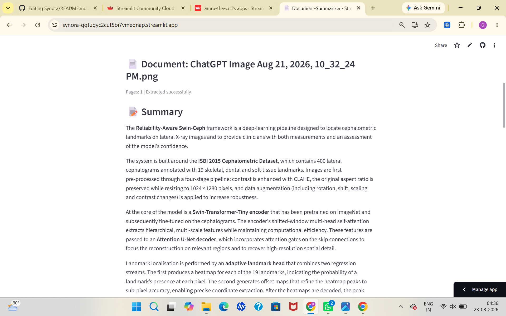
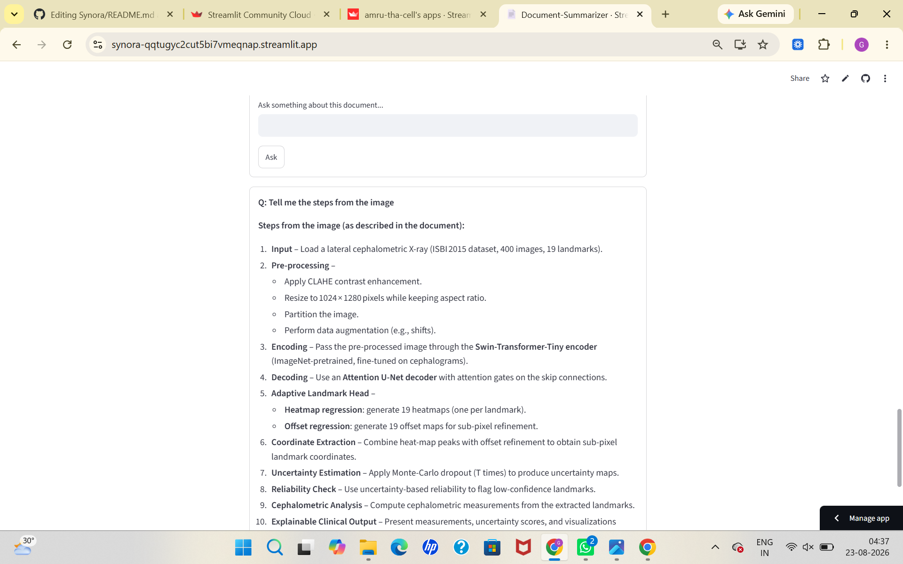

<div align="center">

# ✦ SYNORA

### AI-Powered Document Intelligence & RAG Assistant

**Understand documents. Extract knowledge. Ask anything.**

<br>

<a href="https://synora-qqtugyc2cut5bi7vmeqnap.streamlit.app/">
  
</a>

<br><br>


<br><br>

> **Transform PDFs and scanned documents into searchable, summarized and grounded knowledge.**

</div>

---

# 🌌 About Synora

**Synora** is an AI-powered document understanding assistant designed to turn lengthy and difficult-to-read documents into actionable knowledge.

Upload a **PDF or image**, and Synora can:

- 📄 Extract document content
- 🔎 Perform OCR on scanned documents
- 🌐 Process multiple Indian languages
- 🧠 Understand document semantics
- 📝 Generate intelligent summaries
- 🔑 Extract key points
- 🎯 Identify main ideas
- 💡 Suggest improvements
- 💬 Answer questions using RAG
- 📌 Provide page-level sources

Unlike a conventional summarizer, Synora uses a **Retrieval-Augmented Generation (RAG)** pipeline to ground answers in the uploaded document.

---

# 🚀 Experience Synora

<div align="center">

### [✨ OPEN THE LIVE APPLICATION →](https://synora-qqtugyc2cut5bi7vmeqnap.streamlit.app/)

<br>

`📤 Upload` &nbsp;→&nbsp; `🌐 Select Language` &nbsp;→&nbsp; `🔍 Analyze`  
&nbsp;→&nbsp; `📝 Understand` &nbsp;→&nbsp; `💬 Ask`

</div>

---

# 🖥️ Application Preview

> Add your screenshots inside `assets/screenshots/`.

<div align="center">


<br><br>

<details>
<summary><b>📸 Explore More Screenshots</b></summary>

<br>

<table>
<tr>
<td align="center">

<br><b>📤 Document Upload</b>
</td>

<td align="center">

<br><b>📝 AI Summary</b>
</td>
</tr>

<tr>
<td align="center">

<br><b>🔑 Key Points</b>
</td>

<td align="center">

<br><b>💬 Document Q&A</b>
</td>
</tr>
</table>

</details>

</div>

---

# 💡 Why Synora?

<details>
<summary><b>🔍 Click to compare Synora with traditional document reading</b></summary>

<br>

| Traditional Approach | ✦ Synora |
|---|---|
| 📚 Read everything manually | ⚡ Content-proportional summaries |
| 🔎 Keyword search | 🧠 Semantic retrieval |
| 🧩 Separate OCR tools | 🔎 Built-in OCR fallback |
| 🌍 Limited language support | 🌐 Multilingual OCR |
| 🤖 Generic chatbot responses | 🎯 Document-grounded answers |
| ❓ Difficult to verify answers | 📌 Page-level source citations |
| 📖 Long documents are overwhelming | ✂️ Map-reduce summarization |

</details>

---

# ✨ Core Capabilities

<table>
<tr>

<td width="50%">

### 📄 Intelligent Document Processing

- PDF support
- PNG / JPG / JPEG support
- PyMuPDF text extraction
- Tesseract OCR fallback
- Page-aware extraction
- Text cleaning & normalization

</td>

<td width="50%">

### 🧠 AI Document Understanding

- Short / Medium / Long summaries
- Key point extraction
- Main idea detection
- Improvement suggestions
- Large-document map-reduce
- Downloadable summaries

</td>

</tr>

<tr>

<td width="50%">

### 💬 Grounded RAG Q&A

- Semantic document search
- FAISS vector retrieval
- Top-K relevant chunks
- Groq-powered generation
- Context-grounded answers
- Page-number source references

</td>

<td width="50%">

### 🌐 Multilingual OCR

- English
- Hindi
- Telugu
- Tamil
- Bengali
- English + regional language combinations

</td>

</tr>
</table>

---

# 🌐 Multilingual OCR

Synora allows the user to select the appropriate OCR language **per document**.

| Language | Tesseract Code |
|---|---|
| 🇬🇧 English | `eng` |
| 🇮🇳 Hindi | `hin` |
| 🇮🇳 Telugu | `tel` |
| 🇮🇳 Tamil | `tam` |
| 🇮🇳 Bengali | `ben` |
| 🇮🇳 Hindi + English | `hin+eng` |
| 🇮🇳 Telugu + English | `tel+eng` |
| 🇮🇳 Tamil + English | `tam+eng` |
| 🇮🇳 Bengali + English | `ben+eng` |

> Selecting the appropriate language prevents cross-script confusion and improves OCR quality.

---

# 🧩 Interactive Project Tour

<details>
<summary><b>🔬 Explore the complete Synora pipeline</b></summary>

<br>

```text
                         ┌──────────────────────┐
                         │   📄 PDF / 🖼 IMAGE  │
                         └──────────┬───────────┘
                                    │
                                    ▼
                    ┌─────────────────────────────┐
                    │       🔎 EXTRACTION         │
                    │                             │
                    │  PyMuPDF     Tesseract OCR  │
                    └──────────────┬──────────────┘
                                   │
                                   ▼
                    ┌─────────────────────────────┐
                    │       🧹 PREPROCESSING       │
                    │                             │
                    │  Clean → Normalize → Chunk  │
                    └──────────────┬──────────────┘
                                   │
                                   ▼
                    ┌─────────────────────────────┐
                    │       🧠 EMBEDDINGS          │
                    │                             │
                    │ Sentence-Transformers      │
                    └──────────────┬──────────────┘
                                   │
                                   ▼
                    ┌─────────────────────────────┐
                    │       ⚡ FAISS INDEX         │
                    │                             │
                    │     Vector Store            │
                    └──────────────┬──────────────┘
                                   │
                    ┌──────────────┴──────────────┐
                    │                             │
                    ▼                             ▼
          ┌─────────────────┐          ┌──────────────────┐
          │ 📝 SUMMARIZATION │          │ 💬 RAG Q&A       │
          │                 │          │                  │
          │ 🔑 Key Points   │          │ Semantic Search  │
          │ 🎯 Main Ideas   │          │ Top-K Chunks     │
          │ 💡 Suggestions  │          │ Context          │
          └─────────────────┘          └────────┬─────────┘
                                                 │
                                                 ▼
                                      ┌────────────────────┐
                                      │     🤖 GROQ LLM    │
                                      └─────────┬──────────┘
                                                │
                                                ▼
                                      ┌────────────────────┐
                                      │ 📌 GROUNDED ANSWER │
                                      │                    │
                                      │   + Page Sources   │
                                      └────────────────────┘
