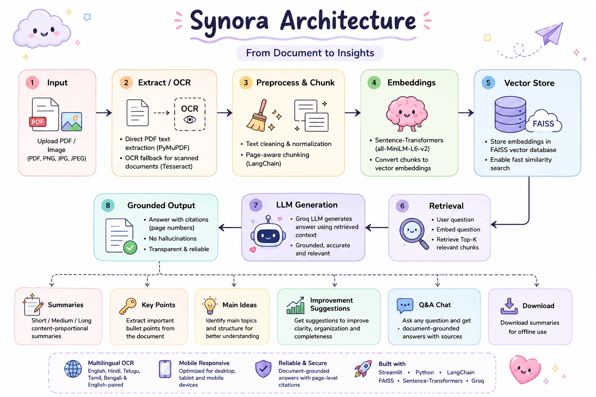
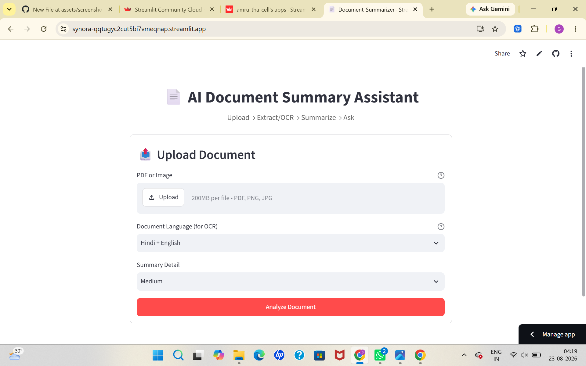
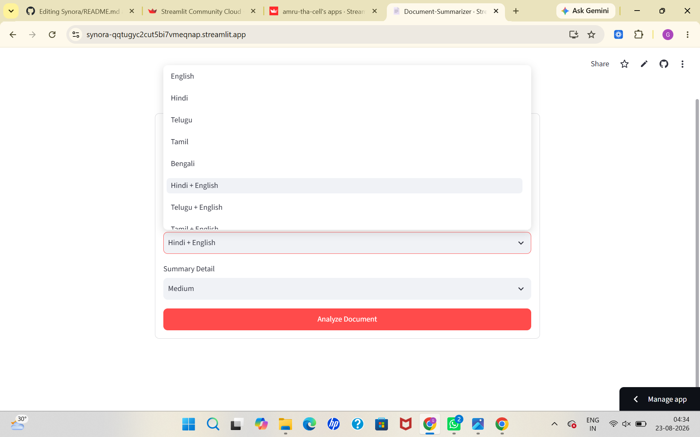
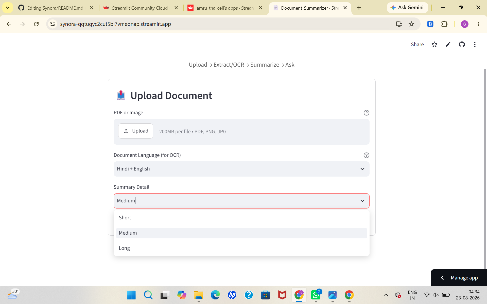
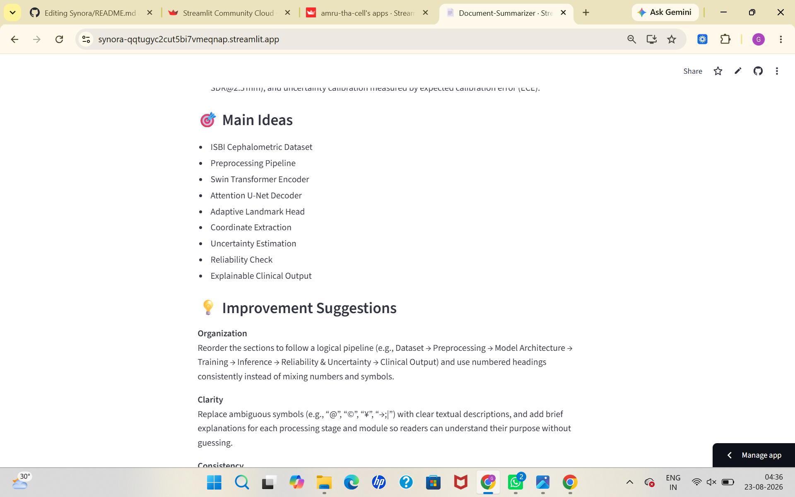

# ✦ SYNORA ✦

### AI-Powered Document Intelligence & RAG Assistant

**Understand documents. Extract knowledge. Ask anything.**

 

  

### [ ✨ OPEN THE LIVE APPLICATION → ](https://synora-qqtugyc2cut5bi7vmeqnap.streamlit.app/)

📤 Upload &nbsp;→&nbsp; 🌐 Select Language &nbsp;→&nbsp; 🔍 Analyze &nbsp;→&nbsp; 📝 Understand &nbsp;→&nbsp; 💬 Ask

---

## 🌌 What is Synora?

**Synora** is an AI-powered document understanding assistant that transforms long PDFs, scanned documents, and images into concise, structured, and searchable knowledge.

Upload a document and Synora can:

- 📄 Extract text from PDFs and images
- 🔎 Perform OCR on scanned documents
- 🌐 Support multilingual OCR
- 📝 Generate intelligent summaries
- 🔑 Extract key points
- 🎯 Identify main ideas
- 💡 Suggest improvements
- 💬 Answer document-based questions
- 📌 Provide page-level sources

At its core, Synora uses a <mark>**Retrieval-Augmented Generation (RAG)**</mark> pipeline to keep answers grounded in the uploaded document.

---
## 🧩 How Synora Works

<mark>**The complete RAG pipeline — from raw document to grounded answer.**</mark>

  

## 🖥️ Synora in Action

  

Upload documents, select OCR language, analyze, summarize, and ask questions.

 

<table>
<tr>

<td align="center">

 
<b>🌐 OCR Languages</b>
</td>

<td align="center">

 
<b>📝 Summary Options</b>
</td>

<td align="center">

 
<b>📄 AI Summary</b>
</td>

<td align="center">

 
<b>🔑 Key Points</b>
</td>

<td align="center">

 
<b>🎯 Main Ideas</b>
</td>

<td align="center">

 
<b>💬 RAG Q&A</b>
</td>

</tr>
</table>

 

> **Transform PDFs and scanned documents into searchable, summarized, and grounded knowledge.**

Built with ❤️ for smarter document understanding.

